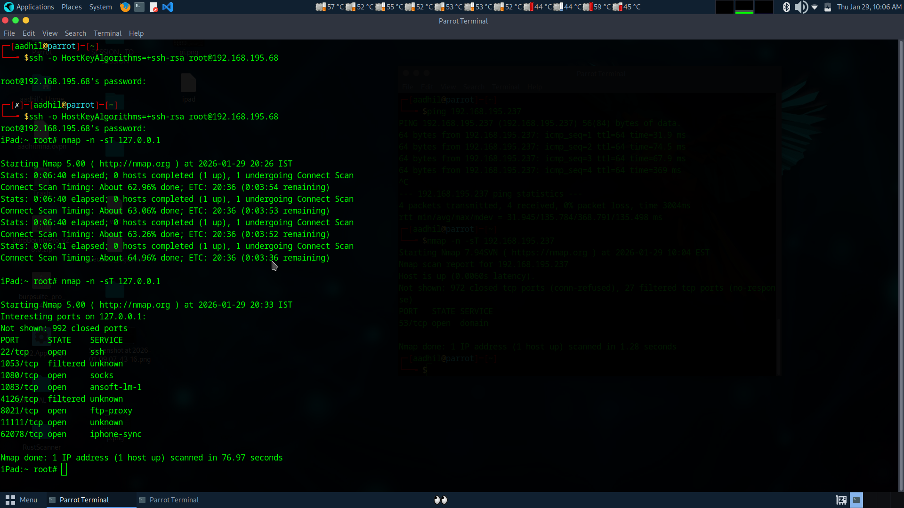

# iOS 9.3.5 Security Research & Penetration Testing

---

## Disclaimer

This repository is for **educational and ethical security research purposes only**.

All testing was performed on **authorized, personally owned devices** in controlled environments.  
Do **not** use this material on systems or devices without explicit permission.

The author is **not responsible** for misuse, damage, or legal consequences resulting from the use of this content.

---

**Purpose:** Ethical Hacking, Security Research & Device Repurposing

This research is not only about Ethical Hacking.
It is also about helping people who still own old Apple devices that can no longer run modern apps.
Many users still have these devices, but they feel “useless” today.

This document is based entirely on personal testing and repeated experiments performed on an iPad 2 running iOS 9.3.5.
Over the course of this research, the device was jailbroken, reset, and restored more than 80 times.
Each iteration exposed different behaviors, command failures, system instabilities, and multiple critical issues originating from Cydia and Cydia-installed applications. All observations documented here are derived from real-world testing — not theory.

Using Phoenix Jailbreak and Cydia, the device becomes a Unix-like environment.

---

## Important Clarification

Jailbreaking does **not** convert iOS into a full Linux system.
The device still runs Apple’s XNU kernel, which restricts:
- Raw sockets
- ICMP scanning
- Advanced packet crafting

All testing was done on personally owned devices in a controlled lab environment.

---

## Devices That Actually Affected and Support iOS 9.3.5

These Apple devices are stuck on iOS 9.3.5 (or 9.3.6 for some models):

### Supported Devices
- iPhone 4s
- iPhone 5
- iPhone 5c
- iPad 2
- iPad 3
- iPad 4

### Tested Devices
- ✅ **Primary Test Platform:** iPad 2 (iOS 9.3.5)

This research primarily targets legacy 32-bit A5/A6 devices whose final supported firmware is iOS 9.3.5.

---

## Limitations of iOS 9.3.5 Devices

### 32-bit Architecture
- Uses 32-bit processors
- Apple ended 32-bit support after iOS 10
- Modern apps are 64-bit only
- Most current apps cannot run

### TLS / HTTPS Issues
- Modern services require TLS 1.2 or TLS 1.3
- iOS 9 uses outdated cryptographic libraries
- Causes broken websites, HTTPS failures, and app connection issues

### App Store Restrictions
- Most apps require iOS 13 or later
- App Store blocks installations
- Developers no longer support iOS 9

### Security Risks
- No security updates
- Do not use for banking, sensitive work, secure communication, or storing credentials

---

## Device Capabilities Without Jailbreak

Even without jailbreaking, an iPad 2 on iOS 9.3.5 can still function as a focused and distraction-free device.

### Reading & Research
- Ideal for reading PDFs and eBooks via iBooks (Apple ID required)  
- Excellent for study, documentation review, and research work  

### Basic Productivity
- Functional web browsing  
- Apple Notes  
- Clock app (world clocks and timers)  

### Notes Workaround
Typing long URLs or text on older hardware is slow and frustrating.

A practical workaround:
- Sign into the same Apple ID on another device (Mac, newer iPhone, Android, Windows, or Linux)  
- Copy text or links on the secondary device  
- Paste directly into synced notes on the iPad  

---

## Jailbreak Environment Preparation

### Before Jailbreaking
- Turn Wi-Fi and Cellular OFF  
- Power off the device and ensure battery is around 50%  
- Back up the device using iTunes or Finder (do not skip)  
- Computer backups are safer than iCloud when jailbreaking.  

### Disable Security Features
- Find My iPhone → OFF  
- Passcode / Touch ID / Face ID → OFF  
- Sign out of iCloud (recommended)  

### Verify Compatibility
- Confirm exact iOS version  
- Confirm device model  
- Ensure the jailbreak tool explicitly supports both  
- If not supported, do not update iOS — updates usually eliminate jailbreak options.  

### Storage & Stability
- Ensure 2–3 GB free storage  
- Use a reliable USB cable  
- Avoid USB hubs  
- Do not touch the device during the jailbreak process  

### Things That Will Break Your Device
- Deleting or modifying system files  
- Running random scripts from forums or paste sites  
- Installing pirated or cracked tweaks  
- Hoarding outdated or incompatible repositories  
- Exposing SSH to public networks  
- Leaving default SSH passwords (root/alpine, mobile/alpine)  

---

## Unix / Linux Environment on Jailbroken iOS

After jailbreaking, iOS gains a POSIX-compliant Unix environment.

Cydia uses APT (Advanced Package Tool) — the same package manager used by Debian and Ubuntu Linux.  
This effectively exposes Linux-style system internals within iOS.

### Common Components Installed
- bash — Bourne-Again SHell  
- grep, sed, find, diff — text and file utilities  
- gzip, bzip2, lzma — compression tools  
- gpg — encryption  
- readline, ncurses — terminal UI support  
- PAM — authentication modules  

### Notes
- APT version 0.7 is common on early iOS jailbreaks  
- Strict dependency checking can cause failures with outdated repositories  
- These tools are required for tweaks, background services, terminals, and daemons  

---

## Major Issues in Phoenix Jailbreak on iOS 9

### Issue 1: Phoenix Certificate Expiration
One of the most important and consistent issues observed is that after 7 days, the Phoenix jailbreak application crashes or fails to open. Not only Phoenix, but also Cydia-based applications and apps installed from Cydia fail to open.

Based on repeated testing and research, this behavior is not a software bug.

It is caused by Apple’s security model, which limits free Apple Developer accounts to 7-day code-signing certificates. Only trusted and properly signed code is allowed to run on iOS.

Once the certificate expires, unsigned or unofficial applications—such as jailbreak tools and apps installed via Cydia—are blocked from launching.

This 7-day limitation is an intentional security measure designed to prevent persistent unauthorized software on iOS devices and to encourage users to remain within Apple’s official ecosystem.

### Apple Developer Account Limits
- Free account → 7-day certificate  
- Paid Developer Program ($99/year) → 1-year certificate  
- Enterprise Program ($299/year)  

Requires registered organization  
Not available to individuals  

This is one of Apple’s strategies to keep users inside their ecosystem.

### Fixing Phoenix After Certificate Expiration

#### Option 1 (Most Common)
To fix the Phoenix security certificate expiration issue, simply reinstall the Phoenix app. Reinstalling automatically creates a new valid certificate, after which you can continue using Phoenix and all previously installed Cydia apps (no reset or restore is required.)

If you accidentally reset the device, you can restore your previous apps and data using iTunes, then reinstall the Phoenix app to jailbreak the device again.

If you do not want to restore previous apps and data, you can perform a full device reset and then reinstall the Phoenix app to jailbreak.

#### Option 2: Use a Paid Apple Developer Account
Using a paid Apple Developer account may extend the certificate validity to one year, but this method is not guaranteed to work 100% in all cases.

If you already have a paid developer account, you can proceed with this option and sign the Phoenix app using your account.

### Important Note
Changing the date and time, or disabling automatic date & time before the 7-day limit will not work.  
The certificate expiration is enforced by Apple servers, not the local device time.

Even after jailbreaking, Apple continues enforcing code-signing trust via the 7-day certificate validation used by Phoenix.

---

## Issue 2: Cydia Issues

In many cases, Cydia database crashes or errors occur due to the use of old, broken, or incompatible repositories on iOS 9, partial or failed Cydia updates that corrupt APT or dpkg, repeated jailbreaking, rebooting, or resetting the device using Phoenix, and broken or unresolved package dependencies.

A corrupted Cydia setup often shows clear symptoms such as being unable to refresh or reload sources, frequent “Unable to locate package” or repository errors, failure to add or remove repositories, and the inability to upgrade core packages like APT, UNIX/Linux utilities, or essential libraries.

Search may stop working, new applications cannot be installed, previously installed packages may not appear inside Cydia, and apps installed through Cydia may fail to open or crash, indicating a severely broken Cydia environment.

### Solving Cydia Repository Issues

Cydia-related issues can usually be resolved using Filza File Manager, Terminal, or Cydia itself (if partially functional).

#### Method 1: Using Cydia or Terminal
- Install and use a Terminal app from Cydia  
- Manually add or remove repository entries via the terminal  
- If the Terminal app does not work, proceed using SSH from another device  

#### Method 2: Using Filza File Manager (Recommended Fallback)
If neither Cydia nor Terminal is functional, the easiest and most reliable method is to use Filza File Manager.

Repository file paths:
- `/etc/apt/sources.list`
- `/etc/apt/sources.list.d/`

Always check both locations.

After Editing Repositories:
- Always respring or reboot the device after making changes (important)  
- Remove any unused, outdated, or incompatible repositories  

---

## Issue 3: Terminal — Observed Behavior

Observed Issues:
- Typed input becomes invisible  
- Terminal freezes during long sessions  
- UI becomes unresponsive while the shell may still be running  

Recommended Mitigations:
- Restart the Terminal app  
- Keep local terminal sessions short  
- Use SSH from another device (recommended)  

This is a user interface bug, not a shell or system failure.

---
## 🎥 Video Demonstrations (Real Device)

The following videos document real behavior on a jailbroken iOS 9.3.5 device and are included for transparency and troubleshooting reference.

### ▶️ Video 1 — Terminal App Auto-Closes After Jailbreak

Description:
After jailbreak, the on-device terminal application fails to stay open and closes immediately. To continue working, an SSH connection is established from another device and used successfully.

Commands shown (over SSH):

sw_vers
df -h
whoami
ls

🔗 Video link:
https://drive.google.com/file/d/1hAhupgXhBVFyhgPntPzcjyRKE8L0VE11/view

### ▶️ Video 2 — Nmap on Legacy iOS (Unprivileged Mode)

Description:
Demonstrates running nmap in unprivileged TCP connect mode on iOS 9.3.5, including:

Scanning a target host device

Scanning the localhost / self (the iOS device itself)

Fast-forwarded sections to save time

Command used:

nmap -unprivileged -n -sT TARGET

🔗 Video link:
https://drive.google.com/file/d/1K4UNADtX0v_I9rSHr3oDTWV5kkIuMqLp/view
## Nmap Scan Screenshot

These videos intentionally avoid SYN scans, UDP scans, and NSE scripts due to raw socket restrictions on iOS.

---
## Conclusion

This research demonstrates that legacy Apple devices running iOS 9.3.5—particularly the iPad 2—remain technically capable of supporting structured and authorized security experimentation.

Beyond technical research, this work also focuses on helping people who still own old Apple devices that can no longer run modern applications. Instead of becoming electronic waste, these devices can be responsibly repurposed as:
- Cybersecurity learning platforms
- Network experimentation labs
- File system exploration systems
- Legacy system research tools
- Educational devices

With the right mindset, old devices can become low-cost security training platforms rather than being discarded.

---

## Future Work

Research on iOS 9.3.5 remains ongoing.

Materials, scripts, and command collections for iOS 9.3.5 are being published and maintained on GitHub:  
https://github.com/aadhilm/iOS-9.3.5-Security-Research-Penetration-Testing

Verified & Tested Commands  
https://github.com/aadhilm/iOS-9.3.5-Security-Research-Penetration-Testing/blob/main/COMMANDS.md

CTF Lab  
https://github.com/aadhilm/iOS-9.3.5-Security-Research-Penetration-Testing/blob/main/LAB.md

The objective is not modernization, but responsible repurposing—using controlled lab environments and openly shared materials to extract meaningful educational and research value from this legacy mobile platform.
